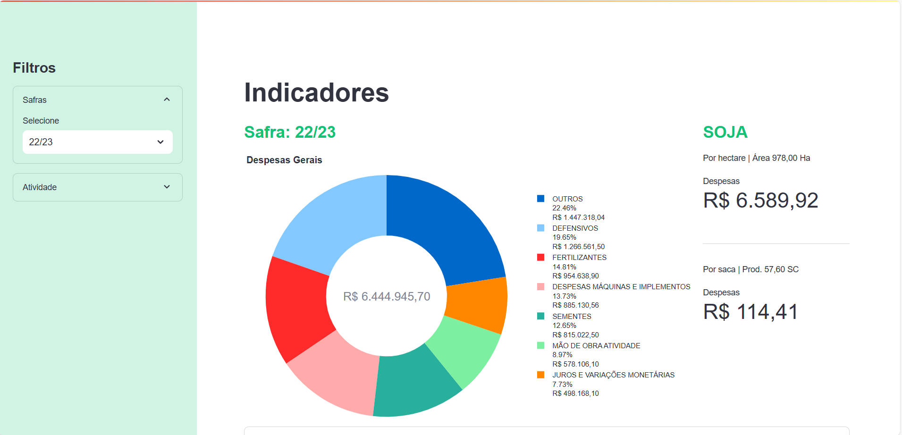

# Dashboard Indicadores

Dashboard de informações financeiras com o detalhamento das despesas por contas.

## Demo

  

## Tecnologias Utilizadas
- [Python](https://www.python.org/) - Versão 3.11.4
- [Streamlit](https://streamlit.io/) - Versão 1.38.0
- [Pandas](https://pandas.pydata.org/) - Versão 2.2.3
- [Requests](https://docs.python-requests.org/en/latest/) - Versão 2.32.3
- [Plotly](https://plotly.com/python/) - Versão 5.24.1

## Instalação

Para rodar o projeto localmente, siga os passos abaixo:

1. Clone o repositório:

   ```bash
   git clone https://github.com/aloiziojr-scadi/dashboard_indicadores.git
   cd dashboard_indicadores

2. Crie um ambiente virtual (opcional, mas recomendado):

    ```bash
    python -m venv venv
    # Windows
    venv\Scripts\activate  # No Linux use`source venv/bin/activate`

3. Instale as dependências:

    ```bash
    pip install -r requirements.txt

## Executando o Aplicativo

Para iniciar o aplicativo Streamlit, execute o seguinte comando:

```bash
streamlit run Dashboard.py
```
O aplicativo estará disponível em http://localhost:8501 recebendo os parâmetros 'url'  e 'token'. 

Exemplo: http://localhost:8501?url=endereco-servidor&token=valor-do-token